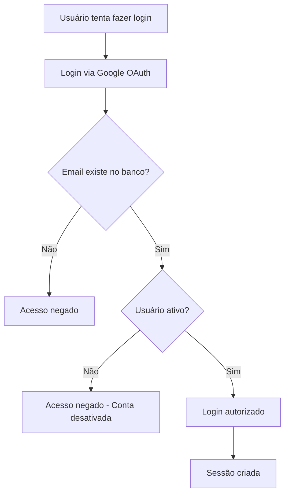

# Sistema de Gerenciamento de Usuários

Este documento descreve o sistema de gerenciamento de usuários implementado na aplicação.

## Visão Geral

O sistema de gerenciamento de usuários permite criar, visualizar, editar e gerenciar usuários da aplicação. Todos os usuários têm acesso administrativo completo ao sistema por padrão.

## Funcionalidades

### CRUD de Usuários

- ✅ **Criar usuário**: Adicionar novos usuários ao sistema
- ✅ **Listar usuários**: Visualizar todos os usuários cadastrados
- ✅ **Editar usuário**: Modificar informações de usuários existentes
- ✅ **Ativar/Desativar usuário**: Controlar o acesso ao sistema
- ✅ **Buscar usuários**: Filtrar por nome ou email

### Funcionalidades de Segurança

- ✅ **Autenticação obrigatória**: Todas as rotas da API requerem autenticação
- ✅ **Validação de dados**: Validação com Zod nos formulários e API
- ✅ **Prevenção de duplicação**: Não permite emails duplicados
- ✅ **Proteção contra auto-desativação**: Usuário não pode desativar sua própria conta

### Interface do Usuário

- ✅ **Interface responsiva**: Funciona em desktop e mobile
- ✅ **Paginação**: Lista paginada para grandes volumes de dados
- ✅ **Busca em tempo real**: Filtro por nome ou email
- ✅ **Feedback visual**: Toast notifications para ações
- ✅ **Estados de loading**: Indicadores visuais durante operações

## Estrutura Técnica

### Schema do Banco de Dados

```typescript
export const usersTable = pgTable('users', {
  id: uuid('id').primaryKey().defaultRandom(),
  name: text('name').notNull(),
  email: text('email').notNull().unique(),
  active: boolean('active').notNull().default(true),
  createdAt: timestamp('createdAt').defaultNow().notNull(),
  updatedAt: timestamp('updatedAt').defaultNow().notNull(),
})
```

### Rotas da API

- `GET /api/users` - Listar todos os usuários
- `POST /api/users` - Criar novo usuário
- `GET /api/users/[id]` - Buscar usuário por ID
- `PUT /api/users/[id]` - Atualizar usuário
- `DELETE /api/users/[id]` - Desativar usuário
- `PATCH /api/users/[id]/toggle-status` - Alternar status ativo/inativo

### Validação de Dados

```typescript
export const insertUserSchema = z.object({
  name: z.string().min(2, 'Nome deve ter pelo menos 2 caracteres'),
  email: z.string().email('E-mail deve ter um formato válido'),
  active: z.boolean().default(true),
})
```

## Autenticação e Autorização

### Como Funciona

1. **Login via Google OAuth**: Usuários fazem login usando conta Google
2. **Verificação no banco**: Sistema verifica se email existe na tabela `users`
3. **Controle de acesso**: Apenas usuários cadastrados e ativos podem acessar
4. **Sessão JWT**: Gerenciamento de sessão com NextAuth.js

### Fluxo de Autenticação



## Como Usar

### Acessar o Gerenciamento de Usuários

1. Faça login no sistema
2. No sidebar, clique em "Administração" → "Usuários"
3. A página de gerenciamento será exibida

### Criar Novo Usuário

1. Na página de usuários, clique em "Novo Usuário"
2. Preencha o formulário:
   - **Nome**: Nome completo do usuário
   - **E-mail**: Email válido (será usado para login)
   - **Usuário Ativo**: Se deve estar ativo por padrão
3. Clique em "Criar Usuário"

### Editar Usuário

1. Na lista de usuários, clique no menu (⋮) do usuário
2. Selecione "Editar"
3. Modifique as informações necessárias
4. Clique em "Atualizar Usuário"

### Ativar/Desativar Usuário

1. Na lista de usuários, clique no menu (⋮) do usuário
2. Selecione "Ativar" ou "Desativar"
3. Confirme a ação na caixa de diálogo

### Buscar Usuários

1. Use a barra de busca no topo da lista
2. Digite o nome ou email do usuário
3. A lista será filtrada automaticamente

## Scripts Úteis

### Criar Usuários de Teste

Para criar usuários de teste no sistema:

```bash
npx tsx scripts/create-test-users.ts
```

Este script criará os seguintes usuários:

- admin@teste.com (Administrador - Ativo)
- joao@teste.com (João Silva - Ativo)
- maria@teste.com (Maria Santos - Ativo)
- pedro@teste.com (Pedro Oliveira - Inativo)

## Considerações de Segurança

### Boas Práticas Implementadas

1. **Validação rigorosa**: Todos os dados são validados antes de salvar
2. **Sanitização**: Dados são sanitizados para prevenir XSS
3. **Autenticação obrigatória**: Todas as rotas protegidas
4. **Controle de permissões**: Usuário não pode desativar própria conta
5. **Logs de segurança**: Erros são logados para auditoria

### Limitações Conhecidas

1. **Todos são administradores**: Não há níveis de permissão diferenciados
2. **Não há histórico**: Não mantém histórico de alterações
3. **Remoção lógica**: Usuários são desativados, não removidos fisicamente

## Troubleshooting

### Problemas Comuns

**Erro: "Já existe um usuário com este e-mail"**

- Solução: Verifique se o email não está já cadastrado

**Erro: "Você não está cadastrado no sistema"**

- Solução: Peça para um administrador cadastrar seu email

**Erro: "Seu acesso foi revogado"**

- Solução: Sua conta foi desativada, contate um administrador

**Página não carrega**

- Solução: Verifique se está logado e se tem permissão de acesso

### Logs de Debug

Para debugar problemas, verifique os logs:

- Navegador: Console do desenvolvedor (F12)
- Servidor: Logs da aplicação Next.js

## Arquivos Relacionados

### Backend

- `src/app/db/schemas/user-schema.ts` - Schema do banco
- `src/app/api/users/route.ts` - Rotas principais da API
- `src/app/api/users/[id]/route.ts` - Rotas específicas por ID
- `src/app/api/users/[id]/toggle-status/route.ts` - Rota para alternar status
- `src/services/user-service.ts` - Service layer
- `src/hooks/use-users.ts` - Hooks do React Query

### Frontend

- `src/app/admin/users/page.tsx` - Página principal
- `src/components/user-form.tsx` - Formulário de usuário
- `src/components/app-sidebar.tsx` - Navegação atualizada
- `src/lib/routes.ts` - Rotas atualizadas

### Scripts

- `scripts/create-test-users.ts` - Script para criar usuários de teste

## Próximos Passos

### Melhorias Sugeridas

1. **Níveis de permissão**: Implementar roles (admin, editor, viewer)
2. **Histórico de ações**: Log de todas as alterações
3. **Importação em lote**: Upload de CSV com usuários
4. **Notificações por email**: Avisar usuários sobre mudanças
5. **Política de senhas**: Para login local alternativo ao Google
6. **Auditoria**: Relatórios de acesso e atividade dos usuários
